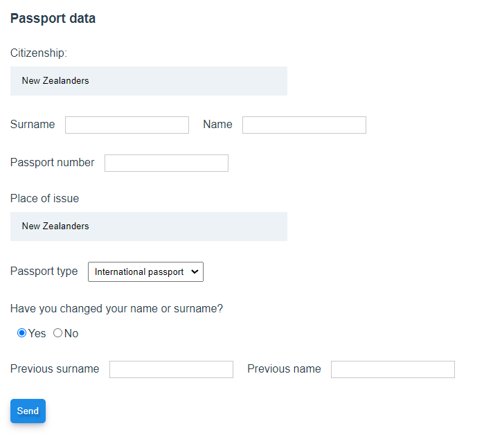

# vue-form

## Vue.js form with validation, fast search, debounce, radio buttons and dynamically displaying fields


##



## Project setup
```
npm install
```

### Compiles and hot-reloads for development
```
npm run serve
```

### Compiles and minifies for production
```
npm run build
```

### Lints and fixes files
```
npm run lint
```
